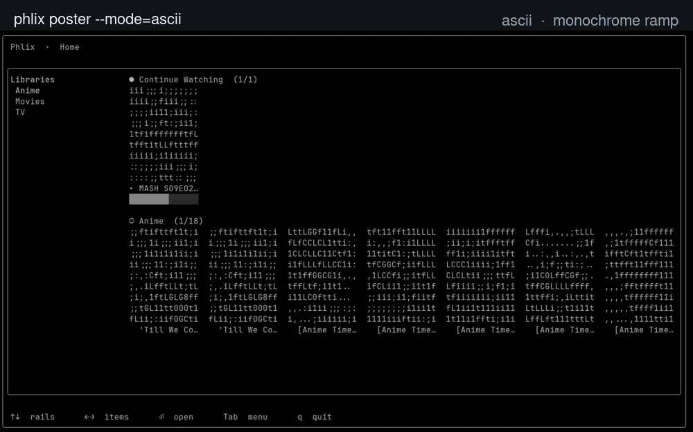
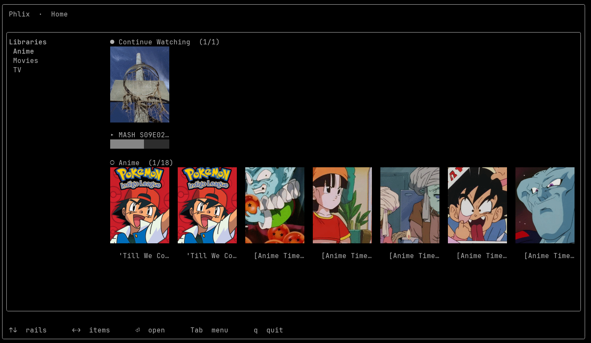
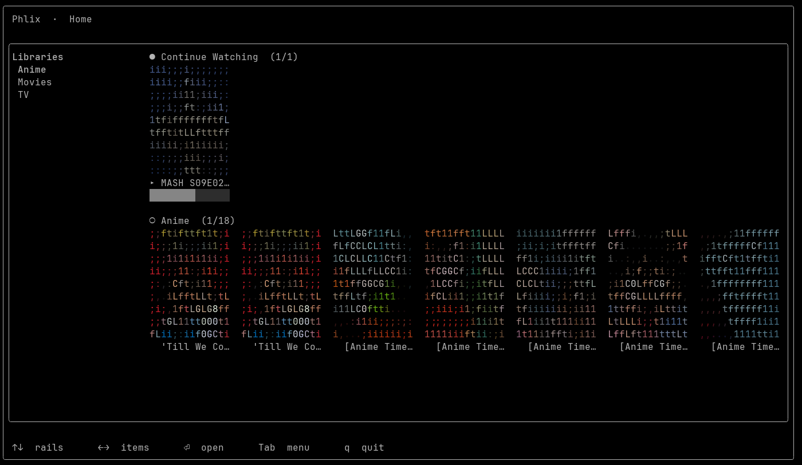
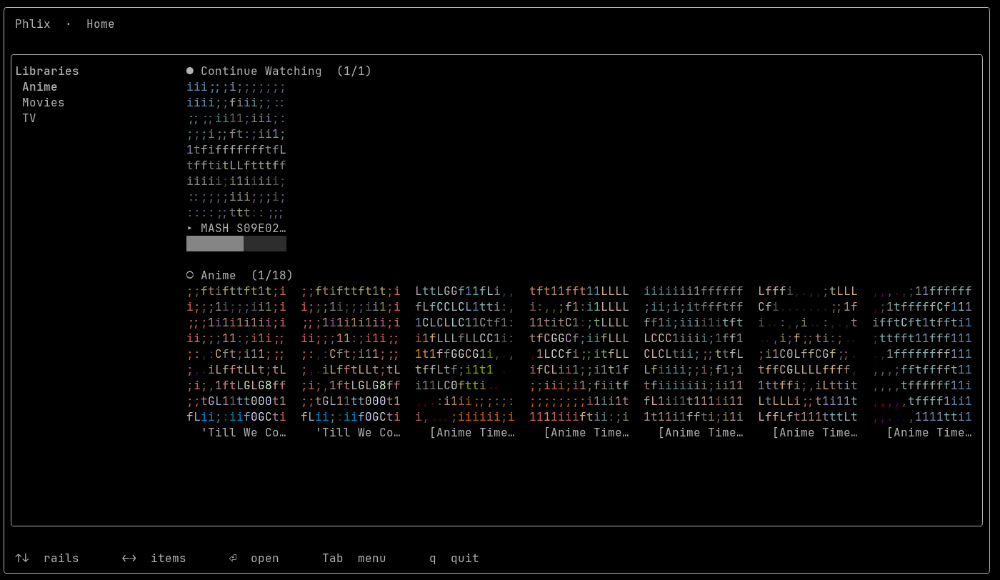
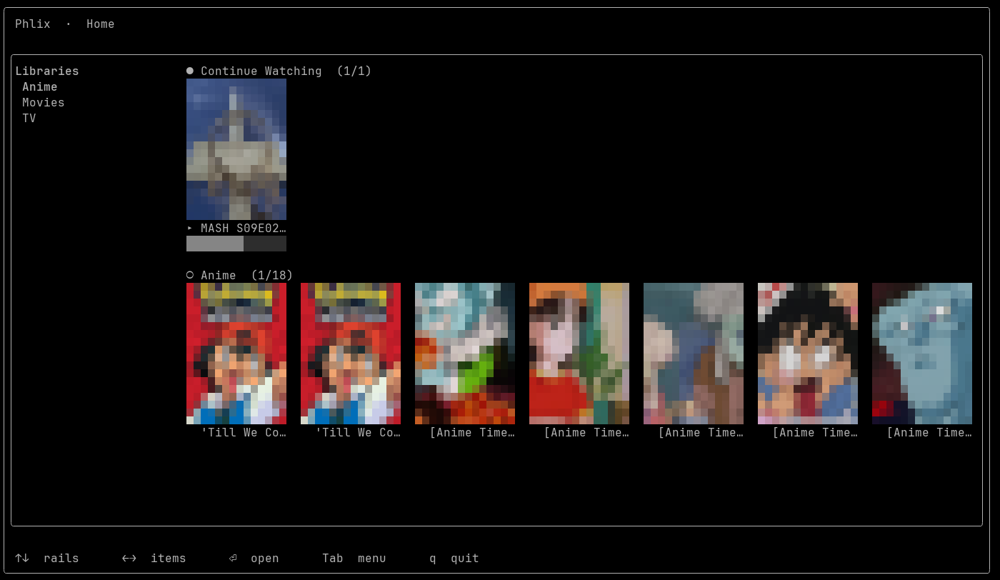
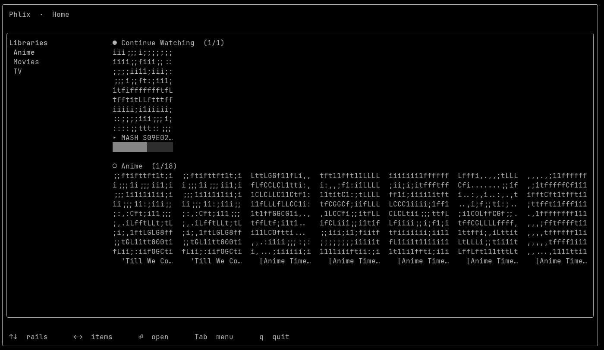

# phlix-console-client

[](https://github.com/detain/phlix-console-client/actions/workflows/ci.yml)
[](https://codecov.io/gh/detain/phlix-console-client)
[](https://github.com/detain/phlix-console-client/tags)
[](LICENSE)
[](https://www.php.net/)

A full-window **terminal (TUI) client for Phlix** — browse libraries, poster
grids, carousels, media detail, series/season/episode drill-down, search, a
command palette, and an in-terminal video player. Posters and video render as
**sixel / kitty / iTerm2 / half-block ANSI** via the
[SugarCraft](https://sugarcraft.github.io/) stack.

## Render modes

The same screen rendered with each `--mode`, cycling every few seconds.
**Graphics** protocols emit a real image (highest fidelity, terminal-dependent);
**cell** modes tile coloured text and work in any terminal, trading detail for
compatibility.



<details>
<summary>Side-by-side stills</summary>

| Mode | Type | Preview |
| --- | --- | --- |
| `sixel` | graphics — sixel protocol |  |
| `iterm2` | graphics — iTerm2 inline images |  |
| `truecolor` | cell — 24-bit colour character ramp |  |
| `ansi256` | cell — 256-colour character ramp |  |
| `quarterblock` | cell — dense 24-bit colour blocks |  |
| `halfblock` (≡ `ansi`) | cell — 24-bit colour half-blocks (universal fallback) |  |
| `ascii` | cell — monochrome character ramp |  |

</details>

> `kitty` is also supported (graphics, kitty protocol) but renders identically to
> the other graphics modes in a capable terminal.

> **Status: Phases 0–8 complete.** The build plan is
> [`../phlix_console_client.md`](../phlix_console_client.md). Working today: log
> in, browse your libraries as poster rails beside a sidebar, open a library into
> a virtualized poster grid (scroll, filter, sort, A–Z jump), open any poster
> into a **detail screen** (hero poster, metadata, synopsis), and drill
> **series → season → episode**, with a **breadcrumb trail** in the header.
>
> Press `p` to launch the **in-terminal player** (Phase 4): it **direct-plays**
> the item's signed stream straight through ffmpeg — decoding HEVC/MKV/AV1 the
> browser can't and bypassing the server transcode — with a **scrubber** (chapter
> ticks + intro/outro skip), **resume** from where you left off, **progress
> reporting**, **up-next** auto-advance between episodes, on-demand **subtitles**,
> and a **transcode fallback** when a file can't be direct-played.
>
> Phase 5 adds **global search** (`/` from anywhere → a debounced query over a
> virtualized poster grid of `/media?search=` results), a **command palette**
> (Ctrl-K or `:` → fuzzy-ranked actions: search, jump to any library, log out,
> quit), and **toasts** — transient top-right notifications that surface errors
> which used to fail silently.
>
> Phase 6 makes **every library type browsable** and audio + photos fully usable —
> opening a library now routes to a browser built for its type:
>
> - **Music** — an album list (Album · Artist · Year · Tracks) → a track table;
>   Enter **direct-plays** the audio through ffplay/mpv, with `Space` pause and
>   `n`/`p` for the next/previous track. (No server cover art → text-forward.)
> - **Books** — a virtualized cover grid (lazy covers) → a detail screen with the
>   cover, metadata, and a copyable **download URL** (there is no in-terminal
>   reader).
> - **Audiobooks** — a list (Title · Author · Narrator · Duration) → a chapter
>   table; Enter plays a chapter, `r` **resumes** from your saved position, `Space`
>   pauses, and your **progress is saved back to the server**. (Text-forward.)
> - **Photos** — a grid of album covers (by date) → an album's thumbnail grid → a
>   **fullscreen photo** (`←`/`→` prev/next) with an **EXIF panel** (`i`) and an
>   auto-advancing **slideshow** (`s`). Thumbnails and full images render directly
>   from signed URLs.
>
> Phase 7 adds **theming, settings, and polish**: three built-in themes —
> **Nocturne** (default), **Daylight**, and **Midnight** — plus a **Settings**
> screen (reachable from the command palette) for picking the theme and the
> photo-slideshow interval, applied live. A persistent **Now-Playing bar** spans
> every screen so music and audiobook audio keeps playing (and stays controllable)
> as you navigate; the palette also toggles a diagnostic **metrics HUD** overlay
> and opens a read-only **Stats** screen, and lists load behind **animated shimmer
> skeletons**.
>
> Phase 8 adds **full admin parity plus casting** (the **Admin** action appears in
> the command palette only when you're signed in as an admin). It opens an **admin
> menu** with every section wired:
>
> - **Dashboard** — now-playing sessions, storage usage, top users, top media, and
>   recent activity.
> - **Users** — list with a status filter (All / Pending / Active / Disabled) and
>   per-row actions: approve, disable, reject, delete, toggle admin, reset password
>   (the new password is revealed once).
> - **Plugins** — list with enable / disable / uninstall and install-from-URL.
> - **Logs** — a file list with a single-file or merged "all logs" tail viewer.
> - **Backup** — list / create / delete / restore / upload-to-S3, plus a backup
>   schedule editor.
> - **Server Settings** — per-key typed editing (bool toggles inline; int / float /
>   string / JSON via a validated input).
> - **Libraries** — scan / rescan / match-metadata with a live scan-status readout.
> - **DLNA server** — status with start / stop.
> - **Remote Access** — Hub, subdomain, relay, and port-forward status with their
>   toggles (the interactive pairing wizard stays on the web admin).
> - **Live TV** — five tabbed sections (Tuners · Channels · Guide · Recordings ·
>   Series Rules) with list + simple actions (create / edit are deferred to the web
>   admin).
>
> **Cast** is not an admin section — press `C` on a media **detail** screen to
> discover **Chromecast / Roku / AirPlay / DLNA** devices on the network, send the
> item, and drive a transport overlay (pause / resume / stop). Seek is intentionally
> omitted — the cast backends don't expose a uniform playback position.

## Requirements

- **PHP ≥ 8.3** with `ext-gd` (image decode), `pcntl` + `posix` (TTY/raw mode).
- **ffmpeg** + **ffprobe** (video decode + frame grabs).
- **ffplay** or **mpv** (audio playback — video, music, audiobooks).
- A terminal with **sixel** or the **kitty**/**iTerm2** graphics protocol is
  recommended; **half-block** is the universal fallback.

## Install

The SugarCraft libraries are normal Composer dependencies, pulled from
Packagist (`sugarcraft/*`, currently tracking `dev-master`).

```sh
composer install
```

### Developing against unreleased library changes

To test the client against local, unmerged SugarCraft changes, add a path
repository **without committing it**:

```sh
composer config repositories.sugarcraft path '../../sugarcraft/*'
composer update 'sugarcraft/*'
# revert before committing:  git checkout composer.json
```

## Run it

```sh
# Launch the full-window app (needs a real TTY): first run asks for your server
# URL, then log in. Browse rails + sidebar → open a library → grid → open a
# poster → detail → drill series/season/episode. Opening a music, book,
# audiobook, or photo library routes to its own browser instead (album list /
# book grid / audiobook list / photo albums). Press `/` to search and Ctrl-K
# (or `:`) for the command palette from anywhere. Esc walks back; Ctrl-C quits.
bin/phlix run
```

Keys: `↑↓←→` move · `⏎` open · `/` search (or filter, in a grid) · Ctrl-K / `:`
command palette · A–Z jump · `p` play · `C` cast (on a detail screen) · `Tab`
switch focus on the home screen · `Esc` back · `Ctrl-C` quit.

The command palette also opens **Settings** (theme + slideshow interval) and the
read-only **Stats** screen, toggles the **metrics HUD**, and — when you're signed
in as an admin — exposes the **Admin** menu (see *Status* above).

**In the player:** `Space` play/pause · `←`/`→` seek ±10s · `0`–`9` seek to % ·
`[` / `]` speed · `m` cycle render mode · `s` skip intro/outro · `o` start over ·
`c` captions · `n` / `p` next / previous episode · `f` toggle chrome · `q`/`Esc`
back.

**Cast** — on a media **detail** screen, `C` opens a device picker (Chromecast /
Roku / AirPlay / DLNA discovered on the network); pick one to send the item, then
drive a transport overlay (`Space` pause/resume, `x` stop, `Esc` back). Seek is
omitted by design (no uniform position across the cast backends).

**Music** — an album list → a track table; `⏎` plays a track (`Space` pause,
`n`/`p` next/previous). **Audiobooks** — a list → a chapter table; `⏎` plays a
chapter, `r` resumes from your saved spot, `Space` pauses (progress is saved
back). **Books** — a cover grid → a detail screen with a copyable download URL.
**Photos** — album covers (by date) → an album's thumbnails → a fullscreen photo
(`←`/`→` prev/next, `i` EXIF panel, `s` slideshow).

### Render diagnostics

```sh
# What can this terminal render?
bin/phlix doctor

# Render an image at 40 cells wide (best available protocol)
bin/phlix poster /path/to/poster.jpg 40
bin/phlix poster /path/to/poster.jpg 40 --mode=halfblock   # force a mode

# Decode the first 3 frames of a video to ANSI (ffmpeg)
bin/phlix frame /path/to/movie.mkv 3 60 20
```

`doctor`, `poster`, and `frame` are non-interactive and work over a pipe;
`run` needs an interactive terminal.

## Test

```sh
vendor/bin/phpunit   # or: composer test
```

The video-decode test self-skips when `ffmpeg` is unavailable; the poster test
synthesizes its own image with `gd`, so the suite needs no fixtures.

## Static analysis

`src/` is checked with **PHPStan at level 9** (its strictest level), enforced in
CI — any new type error fails the build. There is **no baseline and no
suppressions**: the whole tree is level-9 clean. Config lives in `phpstan.neon`.

```sh
composer phpstan   # or: vendor/bin/phpstan analyse
```

## License

MIT
